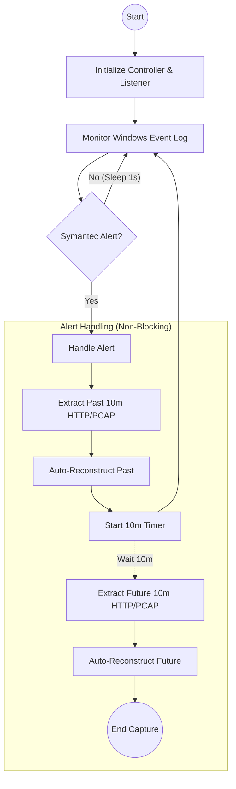

# Web Replay

## Event-Driven Web Traffic Capture & Reconstruction

A powerful tool for capturing, analyzing, and reconstructing web traffic in response to security alerts. Combines a Flask-based web interface with automated background capture using `mitmproxy` and `dumpcap` (Wireshark), triggered by Windows Event Log monitoring.

## 🎯 Features

- **Web Interface**: User-friendly dashboard to view capture status and browse reconstructed web pages
- **Automated Traffic Capture**:
  - **MITM Capture**: Uses `mitmproxy` to intercept and log HTTP/HTTPS flows, including headers and bodies
  - **PCAP Capture**: Uses `dumpcap` for continuous rotating packet capture
- **Event-Driven Monitoring**: Listens for specific Windows Event Log entries (Symantec alerts) to trigger automatic data preservation
- **Web Page Reconstruction**: Automatically reconstructs web pages from captured JSON data with full decompression support (gzip, Brotli, deflate)
- **Intelligent Filtering**: Displays only user-facing web pages, filtering out ads, APIs, tracking pixels, and technical HTML responses
- **Pagination**: Efficiently browse through large numbers of captured URLs with paginated views

## 🏗️ System Architecture

The following flowchart illustrates how the system monitors for alerts and handles capture windows:



## 📋 Requirements

**System Requirements:**
- **Python 3.x**
- **Wireshark**: Ensure `dumpcap` is in your system PATH
- **mitmproxy**: https://www.mitmproxy.org (only needed if pip installing does not work)
- **Windows OS**: Required for `pywin32` event log monitoring

**Python Dependencies:**
Install dependencies using:
```bash
pip install -r requirements.txt
```

## 🗂️ Project Structure

```
WebEMT/
├── app.py                          # Main Flask application entry point
├── test.py                         # Test script for injecting Symantec events
├── requirements.txt                # Python dependencies
├── README.md                       # Project documentation
├── modules/                        # Core logic modules
│   ├── capture_controller.py       # Manages mitmdump and dumpcap processes
│   ├── event_listener.py           # Monitors Windows Event Logs
│   ├── mitm_addon.py               # mitmproxy script for logging HTTP flows
│   └── reconstructor.py            # Web page reconstruction logic
├── templates/                      # HTML templates for web interface
│   ├── layout.html                 # Base template layout
│   ├── nav.html                    # Navigation component
│   ├── homepage.html               # Dashboard/home page
│   └── urls.html                   # Captured URLs listing page
├── static/                         # Static assets (CSS, images)
│   ├── styles.css                  # Application styles
│   └── bg.png                      # Background image
└── data/                           # Captured data storage (created at runtime)
    ├── output/                     # JSON flows and PCAP files
    │   ├── web/                    # HTTP flow JSON files
    │   └── pcap/                   # Extracted PCAP files
    ├── reconstructed/              # Reconstructed static web pages
    └── pcap_rotating/              # Temporary rotating PCAP buffer
```

## 🚀 Quick Start

### 1. Installation

Clone the repository and install dependencies:

```bash
git clone <repository-url>
cd WebEMT
pip install -r requirements.txt
```

### 2. Running the Application

Start the application:

```bash
python app.py
```

This will launch:
- The Flask web server on `http://127.0.0.1:5000`
- `mitmdump` on port 8080 (listening for proxy traffic)
- `dumpcap` for background packet capture
- The Windows Event Log listener

### 3. Configure Proxy

Set your browser or system proxy to `127.0.0.1:8080` to start capturing traffic.

### 4. Install CA Certificate

To intercept HTTPS traffic without warnings:
1. With the proxy configured, visit [http://mitm.it](http://mitm.it) in your browser
2. Click the icon for your operating system (Windows) to download the certificate
3. Install the certificate into your **Trusted Root Certification Authorities** store

### 5. Access the Dashboard

Open `http://127.0.0.1:5000` in your browser to see the system status.

### 6. View Reconstructed Pages

Navigate to the `/urls` page (or click "View Captured URLs" on the homepage):
- **✓ Reconstructed Pages**: Shows only actual user-facing web pages (excludes ads, APIs, tracking, iframes)
- **⊗ Non-Reconstructed URLs**: All other captured traffic (paginated, 10 items per page)
- **[CACHED]** tag indicates pages that were served from browser cache (304 status)

## 🔧 How It Works

### Event-Driven Capture

1. **Continuous Monitoring**: The system continuously monitors Windows Event Logs for Symantec AntiVirus alerts
2. **Alert Detection**: When a specific alert (Event ID: 1090453555) is detected, the system triggers capture
3. **Past Window Extraction**: Immediately extracts the past 10 minutes of HTTP flows and PCAP data
4. **Auto-Reconstruction**: Automatically reconstructs captured web pages
5. **Future Window Capture**: Starts a 10-minute timer to capture future traffic
6. **Non-Blocking**: The event listener continues monitoring while captures are processed in the background

### Decompression Support

The reconstructor supports multiple compression formats:
- **Brotli (br)**: Modern compression used by sites like YouTube, Google
- **Gzip**: Traditional HTTP compression
- **Deflate**: Alternative HTTP compression

### Caching Behavior

Web pages served from browser cache (304 Not Modified) appear in the index with a `[CACHED]` tag but cannot be reconstructed since no content was captured. 

**To capture cached pages:**
- Clear your browser cache before capturing
- Use incognito/private browsing mode

## 🔍 Intelligent Filtering

The system automatically filters out non-user-facing content:

- **Ad Networks**: doubleclick, googlesyndication, googleadservices
- **API Endpoints**: `/api/`, `/xhr/`, `/ajax/`, `/graphql`
- **Tracking**: `/analytics/`, `/beacon/`, `/pixel/`
- **Embedded Content**: iframes, widgets, frames

Only real web pages that users actually view are displayed in the reconstructed pages list.

## 💾 Data Storage

All captured data is organized in the `data/` directory:

- **`output/web/`**: JSON files containing HTTP flows
  - Format: `http_past10_<timestamp>.json` or `http_future10_<timestamp>.json`
- **`output/pcap/`**: PCAP files for network analysis
  - Format: `pcap_past10_<timestamp>.pcapng` or `pcap_future10_<timestamp>.pcapng`
- **`reconstructed/`**: Reconstructed web pages organized by domain
- **`pcap_rotating/`**: Temporary rotating buffer (20 files × 60 seconds each)

## 🛠️ Customization

### Changing Alert Trigger

Edit `modules/event_listener.py` to customize the event trigger:

```python
self.event_id = 1090453555  # Change to your event ID
self.source = "Symantec AntiVirus"  # Change to your event source
```

### Adjusting Capture Window

Edit `modules/capture_controller.py` to change the capture duration:

```python
def __init__(self, buffer_minutes=20):  # Change buffer size
    # ...
    
# In handle_alert():
self.extract_http_window(10, http_out)  # Change to desired minutes
```

## 🔒 Use Cases

- **Security Incident Response**: Automatically capture web traffic context around security alerts
- **Threat Analysis**: Reconstruct and analyze malicious web pages visited during incidents
- **Forensics**: Preserve evidence of web-based attacks for investigation
- **Research**: Study phishing sites, malware delivery, and attack patterns

## ⚠️ Important Notes

- **HTTPS Interception**: Requires installing the mitmproxy CA certificate
- **Performance**: Continuous capture may consume disk space; monitor the `data/` directory
- **Privacy**: This tool captures all web traffic through the proxy; use responsibly
- **Windows Only**: Event log monitoring requires Windows OS

## 📄 License

This project is available for educational and research purposes.

## ⚠️ Disclaimer

This tool is for made for research purposes only. Always ensure you have proper authorization before capturing network traffic.


